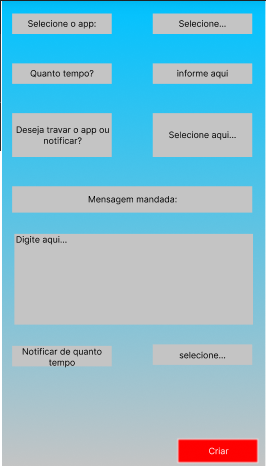
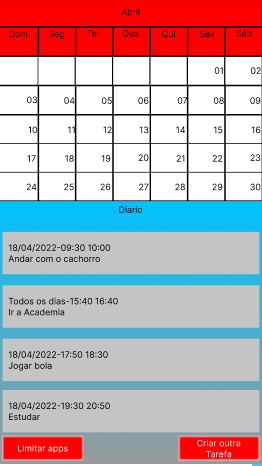
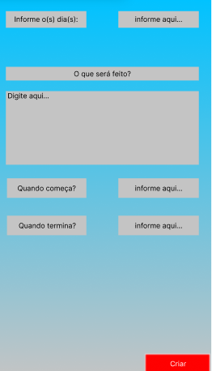

# Informações do Projeto
`TÍTULO DO PROJETO`  

  G5 - PROCRASTINAÇÃO

`CURSO` 

  CIÊNCIAS DA COMPUTAÇÃO

## Participantes

GABRIEL OLIVEIRA COSTA
>
GUSTAVO LORENZO CAMPOS VIEIRA
>
IVO AUGUSTO NEVES DALCIN
>
LUÍS GUSTAVO DE MORAIS COSTA
>
WANDERSON DE SOUZA PESSOA

# Estrutura do Documento

- [Informações do Projeto](#informações-do-projeto)
  - [Participantes](#participantes)
- [Estrutura do Documento](#estrutura-do-documento)
- [Introdução](#introdução)
  - [Problema](#problema)
  - [Objetivos](#objetivos)
  - [Justificativa](#justificativa)
  - [Público-Alvo](#público-alvo)
- [Especificações do Projeto](#especificações-do-projeto)
  - [Personas e Mapas de Empatia](#personas-e-mapas-de-empatia)
  - [Histórias de Usuários](#histórias-de-usuários)
  - [Requisitos](#requisitos)
    - [Requisitos Funcionais](#requisitos-funcionais)
    - [Requisitos não Funcionais](#requisitos-não-funcionais)
  - [Restrições](#restrições)
- [Projeto de Interface](#projeto-de-interface)
  - [User Flow](#user-flow)
  - [Wireframes](#wireframes)
- [Metodologia](#metodologia)
  - [Divisão de Papéis](#divisão-de-papéis)
  - [Ferramentas](#ferramentas)
  - [Controle de Versão](#controle-de-versão)

# Introdução

## Problema

  A procrastinação é um problema recorrente na sociedade que afeta várias pessoas, principalmente jovens e estudantes, onde estará o foco principal do trabalho.
  >
  Procrastinar consiste em adiar e prolongar uma situação ou tarefa para depois, sendo um comportamento normal do ser humano, porém muito prejudicial. 
  >
  Logo, o projeto propõe uma solução para vestibulandos e pessoas que que pretendem implementar uma rotina de estudo estável, podendo ser utilizada por escolas, cursinhos, faculdades ou até individualmente.

## Objetivos

  Desenvolver um software simples, intuitivo, flexível, interativo e que auxilie na organização de estudantes, com foco em seus objetivos finais. Especificando-se em vestibulandos e universitários que precisam ter uma rotina de estudos flexível de acordo com suas metas e seus resultados. Sendo assim, é possível que, durante o amadurecimento do projeto, por causa da flexilidade, o programa possa ser utilizado por mais grupos, como empresas e esportístas.

## Justificativa

  O software pretende fornecer dicas viáveis de acordo com as informações fornecidas pelo usuário, enquanto este preenche uma planilha(atividade/hora) com suas tarefas diárias. É possível assim, que o estudante consiga obtenha melhor organização de estudos e controle de seu rendimento diário, semanal e mensal. 
>
  Todas as características antes comentadas no tópico "Objetivos" devem ser essencialmente acrescentadas, considerando que o aplicativo pretende simplificar a rotina, diminuir a quantidade de informações decoradas e tempo gasto pelo usuário, então é indispensável que ele seja simples, intuitivo, flexível e interativo.

## Público-Alvo

  O pricipal público-alvo são os estudantes que pretendem prestar algum vestibular e universitários. O foco do aplicativo é auxiliar pessoas que não possuem uma meta mas não consegue se organizar, então é essencial que estes estudantes possuam um objetivo final bem definido, sendo uma característica mais notada entre estudantes do 3° EM, de cursinhos, ou que estudam sozinhos. Como é uma ferramenta de controle de atividades, não é necessário que os usuário tenham algum conhecimento aprimorado em tecnologia, considerando que um dos focos é tornar o software acessível e intuitivo, mas é essêncial que tenha alguma base para os vestibulares que pretende prestar.
>
  O público pretendido(que fizeram parte da pesquisa), são pessoas com menos de 27 anos, que possuem alguma dificuldade de concentração, organização e de planejamento.
>
  Os influenciadores seriam psicólogos e cursinhos. Pessoas importantes seriam indivíduos antes procrastinadores e que conseguiram superar este problema / pessoas com alta produtividade. E os fundamentais seriam Estudantes, vestibulandos e jovens em geral.

# Especificações do Projeto

Nessa etapa, os próximos tópicos abordaram sobre a teoria de como seria a necessidade e funcionalidade do projeto, utilizando como base as respostas obtidas nas pesquisas realizadas no campus da PUC, como as personas desenvolvidas e como elas seriam beneficiadas pelo programa, assim como necessidades e requisítos necessácios para sua implementação, com a classificação de priorização para cada descrição.

## Personas e Mapas de Empatia
|                    Larissa                 ||
|--------------------------------------------|------------------------------------------------------------------------------------|
|                      Meta                  | Se formar em seu curso com o melhor rendimento possível |
|                    Problemas               | Sua visão é mais focada para o mercado de trabalho, então sente falta de se dedicar à teoria do curso |
|           Como o projeto pode ajudar       | Melhorar seu rendimento estudantil e sua organização de tarefas diárias |
>
>
|                    Guilherme               ||
|--------------------------------------------|------------------------------------------------------------------------------------|
|                      Meta                  | Investir em sua carreira professional para seguir seu sonho de ingressar em uma empresa que ajude animais em perigo |
|                    Problemas               | Desmotivado por críticas da família, diminuindo assim sua empolgação e rítmo de estudos |
|           Como o projeto pode ajudar       | Incentivar ele a cumprir suas metas e controlariam suas atividades para que ele não diminua o rítmo de estudos|
>

|                    Matheus                 ||
|--------------------------------------------|------------------------------------------------------------------------------------|
|                      Meta                  | Morar no exterior, realizar vários cursos/projetos e  possuir vários grupos de amigos |
|                    Problemas               | Sua visão é mais focada para o mercado de trabalho e como ela irá se adaptar a ele |
|           Como o projeto pode ajudar       | organizar suas atividades, mantendo um limite de atividades, além de recomendações para que possa montar um cronograma mais restrito, principalmente ao considerar que ele ainda está estudando para vestibulares |
>
>

## Histórias de Usuários

Com base na análise das personas forma identificadas as seguintes histórias de usuários:

|EU COMO... `PERSONA`| QUERO/PRECISO ... `FUNCIONALIDADE` |PARA ... `MOTIVO/VALOR`                              |
|--------------------|------------------------------------|-----------------------------------------------------|
|Matheus             | Organizar minhas atividades        | Cumprir todas as tarefas que me disponho para fazer |
|Larissa             | Melhorar meu rendimento estudantil | Me formar e adentrar ao mercado de trabalho         |
|Guilherme           | Não diminuir o ritmo de estudo     | Investir em sua carreira professional               |

## Requisitos

As tabelas que se seguem apresentam os requisitos funcionais e não funcionais que detalham o escopo do projeto.

### Requisitos Funcionais

|ID    | Descrição do Requisito  | Prioridade |
|------|-----------------------------------------|----|
|RF-001| Permitir que o usuário cadastre tarefas | ALTA | 
|RF-002| Emitir um relatório de tarefas no mês   | MÉDIA |
|RF-003| Realizar um sistema de bonificação      | MÉDIA |
|RF-004| Objetivos diários | BAIXA |
|RF-005| Notificação de tarefas pendentes ou futuras | ALTA |
|RF-006| Limite de tempo por atividade no calendário | ALTA |

### Requisitos não Funcionais

|ID     | Descrição do Requisito  |Prioridade |
|-------|-------------------------|----|
|RNF-001| O sistema deve ser responsivo para rodar em um dispositivos móvel | ALTA | 
|RNF-002| Deve processar requisições do usuário em no máximo 3s |  BAIXA | 
|RNF-003| Monitoramento de atividade do dispositívo móvel| BAIXA |
|RNF-004| Compatibilidade com IOS e Android| MÉDIA |
|RNF-005| Limitação do tempo de uso de aplicativos| BAIXA |

## Restrições

O projeto está restrito pelos itens apresentados na tabela a seguir.

|ID| Restrição                                             |
|--|-------------------------------------------------------|
|01| O projeto deverá ser entregue até o final do semestre |
|02| Não pode ser desenvolvido um módulo de backend        |
|03| Não pode ter cronogramas já programados, tudo deve ser construído pelo usuário| 

# Projeto de Interface

Foram criadas as primeiras wireframes, feitas pelo aplicativo do Figma.

## Wireframes

>

>

# Metodologia

A primeira metodologia utilizada no projeto foi o Brainstorm. Colocando todas as ideias no papel, foi possível projetarmos qual seria nossa matriz CSD(certezas, suposições e dúvidas). A segunda foi o scrum, em que o grupo se dividiu para que cada um realizasse pequenas tarefas que seria interligas no relatório. Com as reuniões realizadas em sala de aula foi possível usar este tempo para organização do trabalho, sendo assim, foi essêncial que cada um contribuísse com com suas ideias para o projeto. Já durante a realização do projeto, foi utilizada principalmente a metodologia do design thinking.

## Divisão de Papéis

A divisão dos papéis e tarefas entre os membros foi organizada de acordo com as especialidades de cada um, sendo separadas entre a entrevista, o relatório, a contrução do esboço do wireframe e criação das personas. 
>
Todos os membros do grupo participaram ativamente no desenvolvimento da documentação no Miro, mas teve alguns que realizaram tarefas individuais, são eles:.
>
- Gabriel: Apresentação(slides), rascunho dos wireframes;
>
- Gustavo: Relatório, entrevista;
>
- Ivo: Auxílio com o relatório;
>
- Luís: Highlights da Pesquisa;
>
- Wanderson: Estruturação dos wireframes pelo Figma e estilo do software.
>

## Ferramentas

| Ambiente  | Plataforma              |Link de Acesso |
|-----------|-------------------------|---------------|
|Processo de Design Thinking  | Miro |  https://miro.com/app/board/uXjVOB2WQhI=/ | 
|Repositório de código | GitHub | https://github.com/ICEI-PUC-Minas-PMGCC-TI/tiaw-pmg-cc-t-20221-g5-procrastinacao  | 
|Wareframes | Figma | https://www.figma.com/file/nfOIiHe123icupTpvNoknF/Untitled?node-id=0%3A1 | 

## Controle de Versão

- Versão 1.0: versão inicial, atualização de bugs e recursos visuais;
- Versão 2.0: mais otimizada, novas ferramentas e harmonização do visual;
- Versão 3.0: mais estável e mais otimizada;
- Versão 4.0: versão final: Testes realizadas, bugs corrigidos, ferramentas definidas, visual definido e estável. 

> Discuta como a configuração do projeto foi feita na ferramenta de
> versionamento escolhida. Exponha como a gerência de tags, merges,
> commits e branchs é realizada. Discuta como a gerência de issues foi
> realizada.
> A ferramenta de controle de versão adotada no projeto foi o
> [Git](https://git-scm.com/), sendo que o [Github](https://github.com)
> foi utilizado para hospedagem do repositório `upstream`.
> 
> O projeto segue a seguinte convenção para o nome de branchs:
> 
> - `master`: versão estável já testada do software
> - `unstable`: versão já testada do software, porém instável
> - `testing`: versão em testes do software
> - `dev`: versão de desenvolvimento do software
> 
> Quanto à gerência de issues, o projeto adota a seguinte convenção para
> etiquetas:
> 
> - `bugfix`: uma funcionalidade encontra-se com problemas
> - `enhancement`: uma funcionalidade precisa ser melhorada
> - `feature`: uma nova funcionalidade precisa ser introduzida
>
> **Links Úteis**:
> - [Tutorial GitHub](https://guides.github.com/activities/hello-world/)
> - [Git e Github](https://www.youtube.com/playlist?list=PLHz_AreHm4dm7ZULPAmadvNhH6vk9oNZA)
> - [5 Git Workflows & Branching Strategy to deliver better code](https://zepel.io/blog/5-git-workflows-to-improve-development/)
>
> **Exemplo - GitHub Feature Branch Workflow**:
>
> 

# **############## SPRINT 1 ACABA AQUI #############**
